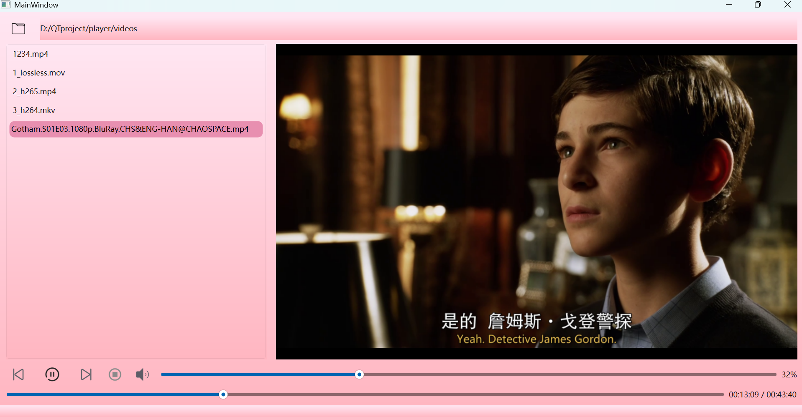

# 项目功能演示（Demo）

## 一、播放器主界面总览
本项目是基于 Qt 6 + FFmpeg 7.1.1 开发的桌面视频播放器，整体界面采用简洁的粉色主题，布局清晰直观，核心功能一目了然。

---

## 二、界面功能分区说明
### 1. 顶部路径栏
- 左侧文件夹图标：点击可选择本地视频文件夹，批量导入视频文件
- 输入框 `folderPath`：显示当前选中的文件夹路径，支持手动输入路径快速访问

### 2. 左侧播放列表区
- 用于展示当前播放列表中的所有视频文件
- 支持点击文件直接切换播放，配合列表循环功能实现自动连播

### 3. 右侧视频播放区
- 黑色区域为视频渲染画布，基于 FFmpeg 解码实现视频画面的流畅播放
- 支持常见视频格式（MP4、MOV、MKV、AVI、FLV 等）的解码与渲染

### 4. 底部控制栏（核心功能区）
从左到右依次为：
- **上一曲**：切换到上一个视频
- **播放/暂停按钮**：控制视频的播放与暂停状态
- **下一曲**：切换到下一个视频
- **停止按钮**：停止当前视频播放，重置播放进度
- **音量控制**：滑块实时调节音量大小，显示当前音量百分比
- **进度条**：拖动滑块可精准定位播放位置，右侧显示当前播放时间/总时长

---

## 三、核心功能亮点
1.  **多格式视频播放**：基于 FFmpeg 硬解码，支持几乎所有主流音视频格式，播放流畅无卡顿
2.  **完整播放控制**：覆盖播放、暂停、停止、进度调节、音量控制全流程操作
3.  **播放列表与循环**：支持批量导入视频，开启列表循环后自动连播，无需手动切换
4.  **美观易用的界面**：Qt 原生界面设计，主题简洁，操作逻辑清晰，上手零门槛

---

## 四、使用说明（补充）
1.  点击顶部文件夹图标，选择存放视频的本地文件夹，自动加载所有视频到左侧列表
2.  双击列表中的视频文件，即可开始播放
3.  通过底部控制栏控制播放状态、调节音量和进度
4.  开启列表循环后，当前视频播放完毕将自动切换到下一个视频，循环播放整个列表